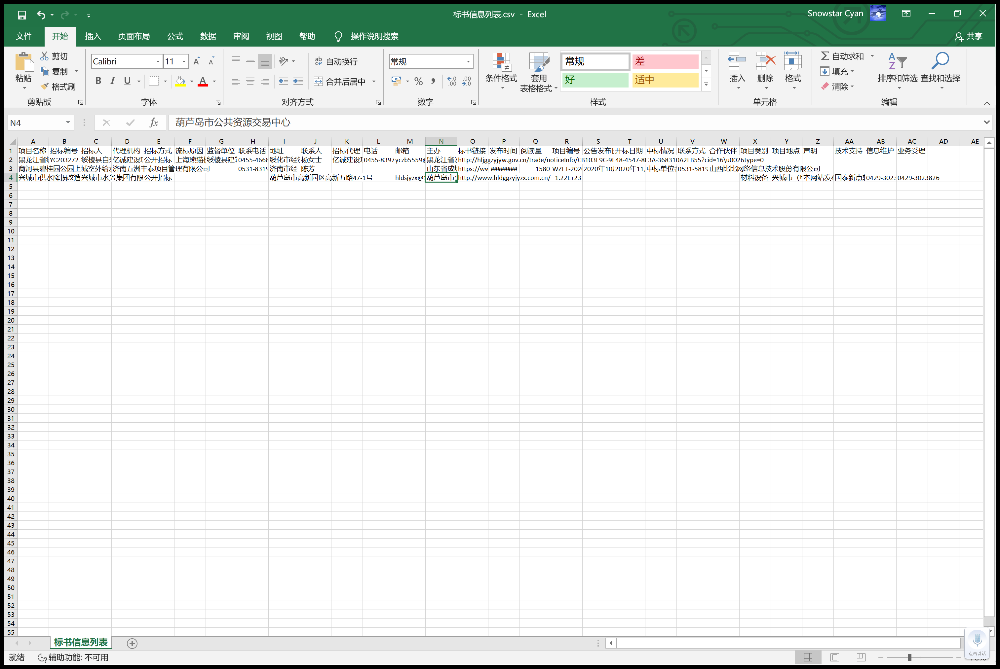

# 标书爬虫DEMO

## 运行指南

1. 下载安装最新Nodejs [下载 | Node.js]( https://nodejs.org/zh-cn/download/current/ )
2. 安装依赖包 `npm i json-2-csv p-map got html2plaintext`
3. 把要爬取的页面地址放到 `tasks.txt` 里一行一个页面
4. 在本项目目录执行 `node fetch.js`
5. 然后结果就会自动放到 `标书信息列表.csv` 这个文件里，可以用 excel 打开它

## 以下是3个示例标书页面

- [公告 - 黑龙江省公共资源交易信息网]( http://hljggzyjyw.gov.cn/trade/noticeInfo/CB103F9C-9E48-4547-8E3A-368310A2FB55?cid=16\u0026type=0 )
- [成交公示详情页-山东省采购与招标网]( https://www.sdbidding.org.cn/bulletins/invitation/2360962 )
- [葫芦岛公共资源中心]( http://www.hldggzyjyzx.com.cn/jyxx/003001/003001004/20201120/17cfd1e8-22c9-4275-badb-5200ac3a7945.html )

## 运行结果

## 参考教程

- [(54 条消息) 爬虫如何自动识别一个网站的正文标题而不需要配置一些参数？ - 知乎]( https://www.zhihu.com/question/268769681 )
- [GitHub - codelucas/newspaper: News, full-text, and article metadata extraction in Python 3. Advanced docs:]( https://github.com/codelucas/newspaper )

## 版权

作者： 雪星 (snomiao@gmail.com) 于 2020-11
协议： 本份代码遵循 BSD 协议，作者仅保留著作权，您可以自由的使用，修改源代码，也可以将修改后的代码作为开源或者专有软件再发布。